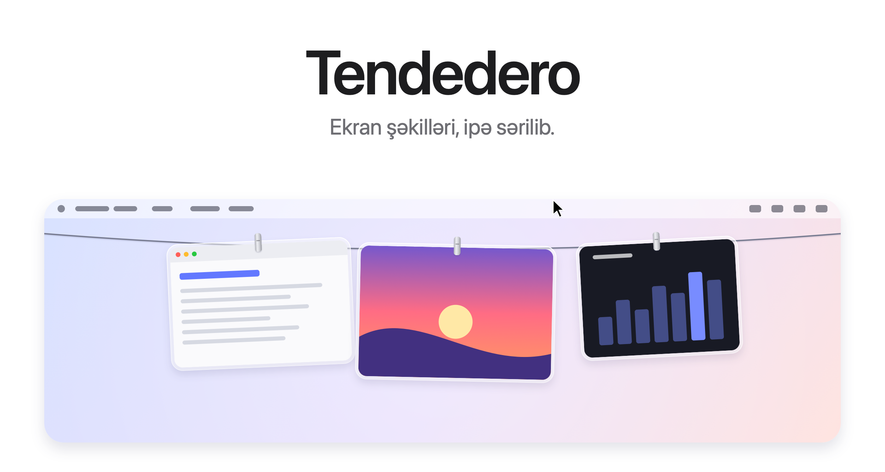
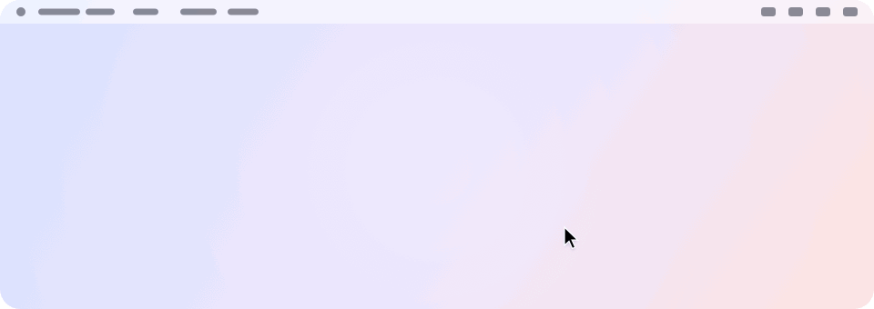
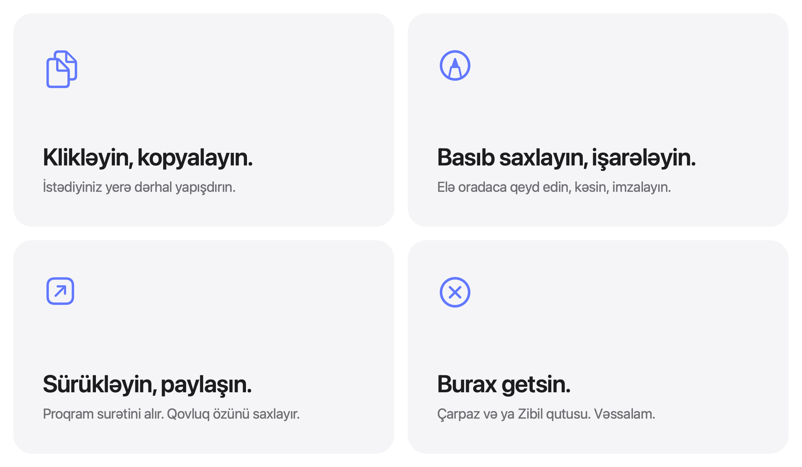

<picture>
  <source media="(prefers-color-scheme: dark)" srcset="../images/az/hero-dark.png">
  
</picture>

<p align="center">
  Pulsuz və açıq mənbəli. macOS 14 və sonrakı versiyalar üçün.
  <br>
  <a href="../../../../releases/latest">Yüklə&nbsp;&rsaquo;</a>
  &nbsp;&nbsp;
  <a href="#mənbə-kodundan-yığmaq">Mənbə kodundan yığ&nbsp;&rsaquo;</a>
  <br><br>
  <a href="../../README.md">English</a>&nbsp;·&nbsp;<a href="README.es.md">Español</a>&nbsp;·&nbsp;<a href="README.zh-Hans.md">简体中文</a>&nbsp;·&nbsp;Azərbaycanca
  <br>
  <sub>İngiliscə README-nin tərcüməsidir. Fərq olarsa, ingiliscə mətn əsasdır.</sub>
</p>

<br>

## Gözdən uzaq. Əl altında.

Çəkdiyiniz hər ekran şəkli ekranın düz üstündəki ipdən asılır.
Göstəricini menyu panelində saxlayın, ip aşağı enir. Uzaqlaşdırın, yox olur.

<picture>
  <source media="(prefers-color-scheme: dark)" srcset="../images/az/demo-dark.gif">
  
</picture>

<br>
<br>

## Hər iş üçün bir hərəkət.

<picture>
  <source media="(prefers-color-scheme: dark)" srcset="../images/az/bento-dark.png">
  
</picture>

<br>
<br>

| | |
|:--|:--|
| Klik | Şəkli kopyalayır. |
| Basıb saxlamaq | Markup-da açır. |
| İki dəfə klik | Preview-da açır. |
| Proqrama sürükləmək | Surətini göndərir. Şəkil ipdə qalır. |
| Qovluğa sürükləmək | Orada saxlanır və ipdən çıxır. |
| Zibil qutusuna sürükləmək və ya çarpaza klik | Ondan qurtulursunuz. |
| Göstəricini menyu panelində saxlamaq | İpi həmin ekranda endirir. |
| Menyu panelində istənilən yerə klik | İpi yığır. |
| <kbd>⌃</kbd>&thinsp;<kbd>⌥</kbd>&thinsp;<kbd>T</kbd> | İpi göstərir və ya gizlədir. |

<br>

## İş masanız, nəhayət, təmiz.

Ekran şəkillərinizi Tendedero-ya tapşırın<sup>1</sup>, onlar İş masasına
heç düşməsin. Üzən miniatür yoxdur. Beş saniyəlik gözləmə yoxdur. Hər şəkil
çəkildiyi an asılır və yalnız ipdən çıxarıb apardığınız qalır.

Eyni qısayollar. Eyni vərdişlər. Sadəcə daha az qarışıqlıq.

<br>

## Məxfilik əsasdan.

Hesab yoxdur. İnternet yoxdur. Analitika yoxdur.
Tendedero tamamilə Mac-inizdə işləyir və ekran şəkilləriniz oradan heç vaxt çıxmır.

<br>

## Texniki göstəricilər

| | |
|:--|:--|
| **Uyğunluq** | macOS 14 Sonoma və ya sonrakı, Apple silicon və Intel Mac-lərdə. macOS 27 üçün hazırlanıb. |
| **Həcm** | 1,7 MB |
| **Dillər** | İngilis, ispan, sadələşdirilmiş Çin və Azərbaycan dili |
| **Nə ilə yazılıb** | Swift, AppKit və SwiftUI |
| **İnternet bağlantısı** | İstifadə etmir |
| **Qiymət** | Pulsuz |
| **Lisenziya** | Kod üçün MIT. Ad və ikona daxil deyil. |

<br>

## Quraşdırma

Disk şəklini [son buraxılışdan](../../../../releases/latest) yükləyin,
açın və Tendedero-nu Applications qovluğuna sürükləyin. Və ya Homebrew ilə quraşdırın:

```sh
brew install --cask alejandrobujan/tap/tendedero
```

Tendedero Developer ID ilə imzalanıb və Apple tərəfindən notarizasiya olunub,
ona görə də istənilən başqa proqram kimi açılır.

<br>

## Mənbə kodundan yığmaq

```sh
git clone git@github.com:alejandrobujan/tendedero.git
cd tendedero
scripts/build-app.sh
open build/Tendedero.app
```

Yalnız Swift alətləri lazımdır, Xcode vacib deyil. macOS 27-nin Command Line
Tools alətləri ilə skript onlarla birlikdə quraşdırılan macOS 26 SDK-sına
keçir, çünki yeni SDK yalnız Xcode-da olan SwiftUI makro plaginini tələb edir.
Yerli yığımlar ad hoc imzalanır, ona görə də hər yenidən yığımdan sonra macOS
İş masasına giriş icazəsini yenidən soruşur.

<details>
<summary>Proqramın içi</summary>
<br>

| Fayl | Nə edir |
|:--|:--|
| `AppDelegate.swift` | Menyu paneli, qısayol, ipi endirmək və yığmaq |
| `LinePanel.swift` | Ekranın yuxarı kənarı boyunca şəffaf zolaq |
| `LineView.swift` | İp və hər şəklin harada asıldığı |
| `PeggedView.swift` | Bir şəkil: şüşə çərçivə, sıxac, yellənmə və meh |
| `GrabArea.swift` | Klik, uzun basma, sürükləyib buraxma |
| `ScreenshotWatcher.swift` | Yeni ekran şəkillərini görür |
| `Inbox.swift` | Ekran şəkli ayarlarını öz üzərinə götürür və geri qaytarır |
| `Markup.swift` | Sistemin Markup redaktorunu açır və nəticəni saxlayır |
| `FullScreen.swift` | Nə vaxt gizli qalmalı olduğunu bilir |
| `Line.swift` | Nəyin asıldığı və onunla nə edə biləcəyiniz |

Buradakı bütün şəkillər, ikona da daxil olmaqla, `scripts/make-icon.swift` və
`scripts/make-readme-art.swift` ilə kodda çəkilir.
`scripts/make-dmg.sh` buraxılışlar üçün disk şəklini yaradır.

Tərcümələr `Sources/Tendedero/Resources` qovluğundadır, hər dil üçün bir
`.lproj` qovluğu. `swift scripts/check-strings.swift` heç birinin əskik
olmadığını yoxlayır.

</details>

<br>

---

<sub>
1. İlk açılışda Tendedero ekran şəkillərinizi idarə etməyi təklif edir. Razılaşsanız, üzən miniatürü söndürür və yeni ekran şəkillərini öz qovluğunda saxlayır. Bu iki ayarı Cmd+Shift+5 menyusunda, Options bölməsində də tapa bilərsiniz. Əvvəlki ayarlarınız yadda saxlanılır və Tendedero bağlananda və ya bu seçim menyu panelindən söndürüləndə geri qaytarılır. Proqram tam ekranda olanda Tendedero özü gizlənir.
</sub>

<br>
<br>

<p align="center">
  
  <br>
  <sub>Kod MIT lisenziyalıdır. Tendedero adı və ikonası isə yox, ona görə də hər fork-un öz adı və ikonası olmalıdır. Ətraflı: <a href="../../LICENSE">LICENSE</a>.</sub>
  <br>
  <sub><a href="https://alejandrobujan.com">Alejandro Buján</a> tərəfindən dizayn edilib və hazırlanıb.</sub>
</p>
