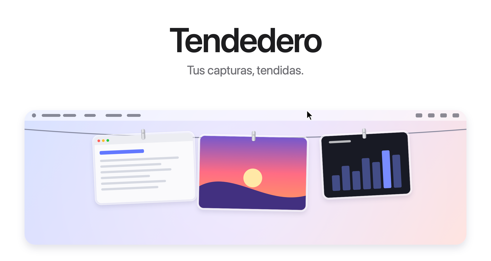
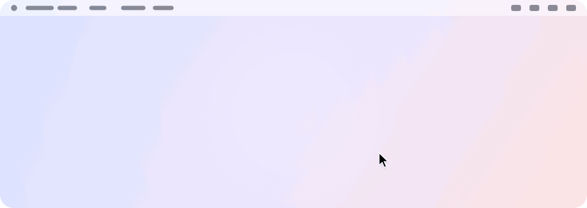
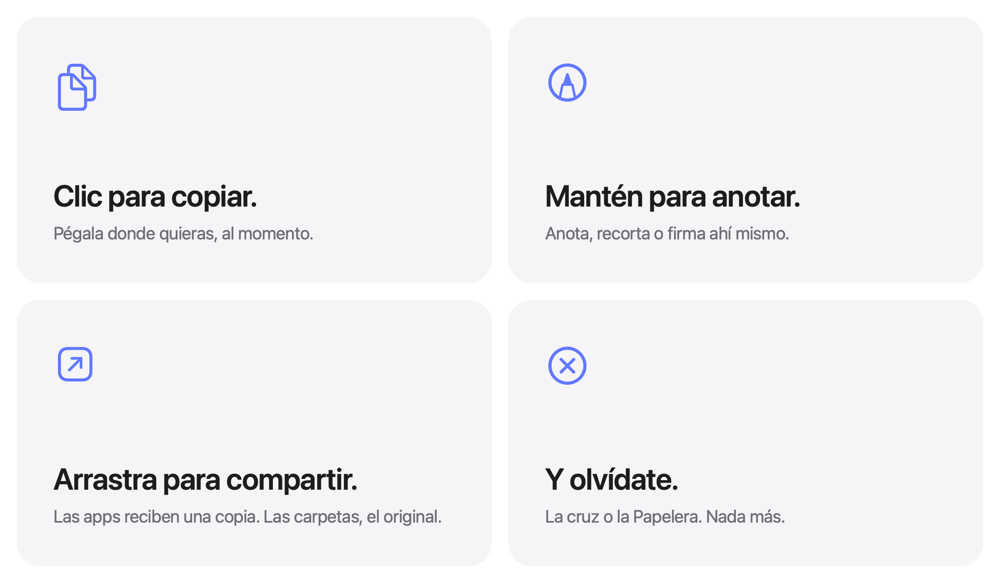
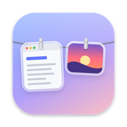

<picture>
  <source media="(prefers-color-scheme: dark)" srcset="../images/es/hero-dark.png">
  
</picture>

<h3 align="center"><a href="https://tendedero.app/?lang=es">Pruébala desde el navegador en tendedero.app&nbsp;&rsaquo;</a></h3>

<p align="center">
  Gratis y de código abierto. Para macOS 14 o posterior.
  <br>
  <a href="../../../../releases/latest">Descargar&nbsp;&rsaquo;</a>
  &nbsp;&nbsp;
  <a href="#compilar-desde-el-código">Compilar desde el código&nbsp;&rsaquo;</a>
  <br><br>
  <a href="../../README.md">English</a>&nbsp;·&nbsp;Español&nbsp;·&nbsp;<a href="README.zh-Hans.md">简体中文</a>
  <br>
  <sub>Traducción del README en inglés. Si algo no coincide, manda el inglés.</sub>
</p>

<br>

## Fuera de la vista. Siempre a mano.

Cada captura que haces queda colgada en una cuerda justo encima de la pantalla.
Lleva el puntero a la barra de menús y la cuerda baja. Apártalo y desaparece.

<picture>
  <source media="(prefers-color-scheme: dark)" srcset="../images/es/demo-dark.gif">
  
</picture>

<br>
<br>

## Un gesto para cada cosa.

<picture>
  <source media="(prefers-color-scheme: dark)" srcset="../images/es/bento-dark.png">
  
</picture>

<br>
<br>

| | |
|:--|:--|
| Clic | Copia la imagen. |
| Mantener pulsado | La abre en Marcación. |
| Doble clic | La abre en Vista Previa. |
| Clic fuerte | Le echa un vistazo con Vista Rápida. |
| Arrastrar a una app | Envía una copia, y la captura sigue colgada. |
| Arrastrar a una carpeta | Se queda ahí y sale de la cuerda. |
| Arrastrar a la Papelera o hacer clic en la cruz | Te deshaces de ella. |
| Dejar el puntero en la barra de menús | Baja la cuerda en esa pantalla. |
| Hacer clic en cualquier sitio de la barra de menús | Recoge la cuerda. |
| <kbd>⌃</kbd>&thinsp;<kbd>⌥</kbd>&thinsp;<kbd>T</kbd> | Muestra u oculta la cuerda. Se cambia en Atajo, en la barra de menús. |

<br>

## Tu Escritorio, por fin despejado.

Deja que Tendedero se encargue de tus capturas<sup>1</sup> y dejarán de pasar
por el Escritorio. Sin miniatura flotante ni cinco segundos de espera: cada
captura se cuelga al momento, y solo se queda lo que tú saques de la cuerda.

Las grabaciones de pantalla también se cuelgan, con un botón de play encima.
Mantén pulsada una para recortarla.

Los mismos atajos y las mismas costumbres. Pero sin desorden.

<br>

## También las imágenes que copias.

Haz una captura con <kbd>⌃</kbd> pulsado, o copia una imagen en Vista Previa,
y se cuelga como cualquier otra. Activa Colgar imágenes copiadas en la barra
de menús; mientras está activo, la camiseta se rellena. Solo imágenes: lo que
se copia junto con texto o un archivo, y lo que un gestor de contraseñas marca
como privado, se deja tal cual.

<br>

## Privacidad de serie.

Sin cuentas, sin conexión a internet, sin analíticas.
Tendedero funciona solo en tu Mac, y tus capturas nunca salen de él.

<br>

## Especificaciones técnicas

| | |
|:--|:--|
| **Compatibilidad** | macOS 14 Sonoma o posterior, en Mac con Apple silicon o Intel. Pensado para macOS 27. |
| **Tamaño** | 1,7 MB |
| **Idiomas** | Inglés, español, chino simplificado, turco y azerbaiyano |
| **Hecho con** | Swift, AppKit y SwiftUI |
| **Conexión a internet** | No la usa |
| **Precio** | Gratis |
| **Licencia** | MIT para el código. El nombre y el icono quedan fuera. |

<br>

## Instalación

Descarga la imagen de disco desde la [última versión](../../../../releases/latest),
ábrela y arrastra Tendedero a Aplicaciones. También puedes instalarlo con Homebrew:

```sh
brew install --cask alejandrobujan/tap/tendedero
```

Tendedero está firmado con un Developer ID y notarizado por Apple, así que se
abre como cualquier otra app.

<br>

## Compilar desde el código

```sh
git clone git@github.com:alejandrobujan/tendedero.git
cd tendedero
scripts/build-app.sh
open build/Tendedero.app
```

Solo necesitas las herramientas de Swift; Xcode es opcional. Si usas las
Command Line Tools de macOS 27, el script tira del SDK de macOS 26 que se
instala con ellas, porque el nuevo necesita un plugin de macros de SwiftUI que
solo viene con Xcode. Las compilaciones locales se firman ad hoc, así que macOS
vuelve a pedir acceso al Escritorio cada vez que recompilas.

<details>
<summary>Por dentro</summary>
<br>

| Archivo | Qué hace |
|:--|:--|
| `AppDelegate.swift` | La barra de menús, el atajo, y bajar y recoger la cuerda |
| `LinePanel.swift` | La franja transparente del borde superior de la pantalla |
| `LineView.swift` | La cuerda y dónde cuelga cada foto |
| `PeggedView.swift` | Cada foto: marco de cristal, pinza, balanceo y brisa |
| `GrabArea.swift` | Clic, pulsación larga, y arrastrar y soltar |
| `ScreenshotWatcher.swift` | Se da cuenta de las capturas nuevas |
| `ClipboardWatcher.swift` | Se da cuenta de las imágenes copiadas |
| `Inbox.swift` | Toma el control de los ajustes de captura y luego los devuelve |
| `Markup.swift` | Abre el editor de Marcación del sistema y guarda el resultado |
| `Trim.swift` | Recorta una grabación de pantalla y guarda el resultado |
| `FullScreen.swift` | Sabe cuándo tiene que quedarse oculto |
| `Line.swift` | Qué hay colgado y qué puedes hacer con ello |

Todas las imágenes de esta página, icono incluido, se dibujan con código en
`scripts/make-icon.swift` y `scripts/make-readme-art.swift`.
`scripts/make-dmg.sh` genera la imagen de disco de cada versión.

Las traducciones están en `Sources/Tendedero/Resources`, con una carpeta
`.lproj` por idioma. `swift scripts/check-strings.swift` avisa si falta alguna.

</details>

<br>

---

<sub>
1. La primera vez que lo abres, Tendedero te ofrece encargarse de tus capturas. Si aceptas, desactiva la miniatura flotante y guarda las capturas nuevas en su propia carpeta; son dos ajustes que también encontrarás en Opciones de Cmd+Mayús+5. Tus ajustes anteriores se guardan y vuelven a su sitio al cerrar Tendedero o al desactivar la opción desde la barra de menús. Mientras una app está a pantalla completa, Tendedero se oculta solo.
</sub>

<br>
<br>

<p align="center">
  
  <br>
  <sub>El código tiene licencia MIT, pero el nombre y el icono de Tendedero no, así que cada fork necesita los suyos. Más detalles en <a href="../../LICENSE">LICENSE</a>.</sub>
  <br>
  <sub>Diseñado y desarrollado por <a href="https://alejandrobujan.com">Alejandro Buján</a>.</sub>
</p>
