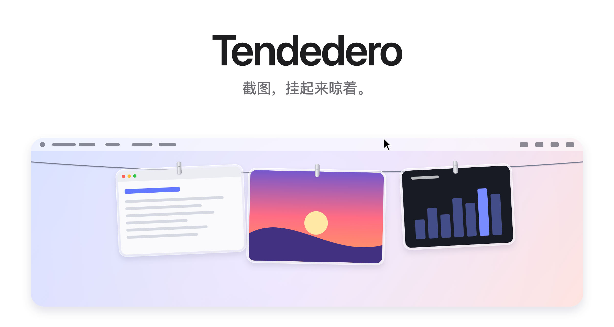
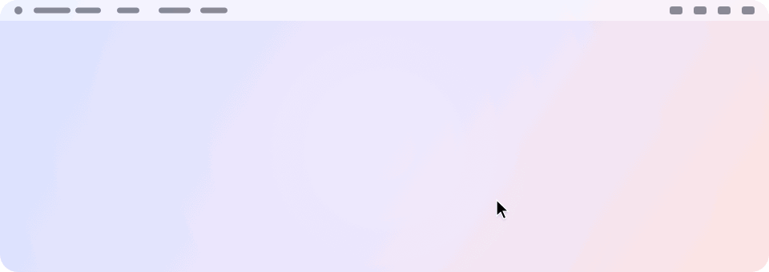
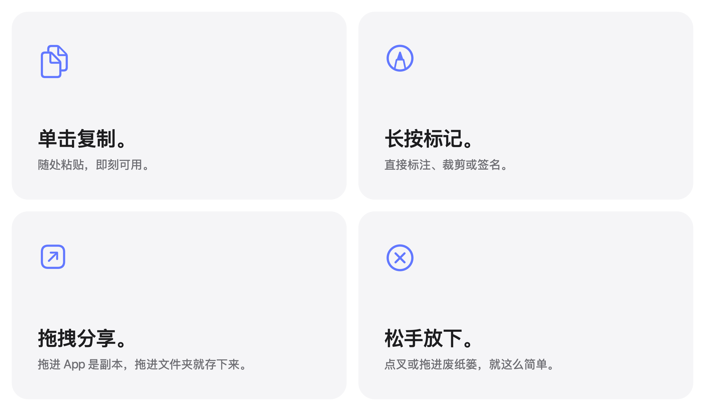

<picture>
  <source media="(prefers-color-scheme: dark)" srcset="../images/zh-Hans/hero-dark.png">
  
</picture>

<p align="center">
  免费开源。适用于 macOS 14 及以上。
  <br>
  <a href="../../../../releases/latest">下载&nbsp;&rsaquo;</a>
  &nbsp;&nbsp;
  <a href="#从源码构建">从源码构建&nbsp;&rsaquo;</a>
  <br><br>
  <a href="../../README.md">English</a>&nbsp;·&nbsp;<a href="README.es.md">Español</a>&nbsp;·&nbsp;简体中文
  <br>
  <sub>本文译自英文 README。如有出入，以英文版为准。</sub>
</p>

<br>

## 看不见，却够得着

你每截一张图，它都会挂到屏幕顶上的一根绳上。
把指针停在菜单栏，绳子就滑下来；移开，它就收起。

<picture>
  <source media="(prefers-color-scheme: dark)" srcset="../images/zh-Hans/demo-dark.gif">
  
</picture>

<br>
<br>

## 每个动作都有手势

<picture>
  <source media="(prefers-color-scheme: dark)" srcset="../images/zh-Hans/bento-dark.png">
  
</picture>

<br>
<br>

| | |
|:--|:--|
| 单击 | 复制这张图。 |
| 长按 | 用「标记」打开。 |
| 双击 | 用「预览」打开。 |
| 拖进 App | 送一份副本过去。原图仍挂在绳上。 |
| 拖进文件夹 | 存在那儿。原图从绳上取下。 |
| 拖到废纸篓，或点叉 | 松手丢弃。 |
| 指针停在菜单栏 | 在那一块屏幕上放下绳子。 |
| 点击菜单栏任意处 | 把绳子收起来。 |
| <kbd>⌃</kbd>&thinsp;<kbd>⌥</kbd>&thinsp;<kbd>T</kbd> | 显示或隐藏绳子。 |

<br>

## 桌面，终于清爽了

把截图交给 Tendedero<sup>1</sup>，它们就完全跳过桌面。
没有浮动缩略图。不用等五秒。拍下的瞬间即挂上绳，只有你拖出去的才会留下。

同样的快捷键。同样的肌肉记忆。只是少了乱。

<br>

## 隐私是设计前提

没有账号。不联网。无统计。
Tendedero 完全在你的 Mac 上运行，截图不会离开这台电脑。

<br>

## 技术规格

| | |
|:--|:--|
| **兼容性** | macOS 14 Sonoma 及以上，Apple 芯片与 Intel 均支持。已针对 macOS 27 设计。 |
| **体积** | 1.7 MB |
| **语言** | 英语、西班牙语、简体中文 |
| **技术栈** | Swift、AppKit 与 SwiftUI |
| **网络访问** | 无 |
| **价格** | 免费 |
| **许可** | 代码为 MIT。名称与图标不在授权范围内。 |

<br>

## 安装

从[最新发布](../../../../releases/latest)下载磁盘映像，打开后把 Tendedero 拖进「应用程序」。也可以用 Homebrew 安装：

```sh
brew install --cask alejandrobujan/tap/tendedero
```

Tendedero 已使用 Developer ID 签名并通过 Apple 公证，打开方式和其他 App 一样。

<br>

## 从源码构建

```sh
git clone git@github.com:alejandrobujan/tendedero.git
cd tendedero
scripts/build-app.sh
open build/Tendedero.app
```

需要 Swift 工具链，Xcode 可选。若使用 macOS 27 的命令行工具，脚本会回退到随其一同安装的 macOS 26 SDK，因为新版 SDK 需要只有 Xcode 才带的 SwiftUI 宏插件。本地构建采用 ad-hoc 签名，所以每次重新构建后 macOS 都会再次询问桌面访问权限。

<details>
<summary>应用内部</summary>
<br>

| 文件 | 作用 |
|:--|:--|
| `AppDelegate.swift` | 菜单栏、快捷键、放下与收起绳子 |
| `LinePanel.swift` | 屏幕顶部那条透明的窄条 |
| `LineView.swift` | 绳子本身，以及每张照片挂在哪里 |
| `PeggedView.swift` | 一张照片：玻璃相框、夹子、摇摆与微风 |
| `GrabArea.swift` | 单击、长按、拖放 |
| `ScreenshotWatcher.swift` | 发现新的截图 |
| `Inbox.swift` | 接管截图设置，之后再把它们放回去 |
| `Markup.swift` | 打开系统「标记」编辑器并保存结果 |
| `FullScreen.swift` | 判断何时该保持隐藏 |
| `Line.swift` | 绳上挂着什么，以及你能对它做什么 |

这里出现的每一张图——包括图标——都是由代码绘制的：
`scripts/make-icon.swift` 与 `scripts/make-readme-art.swift`。
`scripts/make-dmg.sh` 负责构建发布用的磁盘映像。

翻译文件位于 `Sources/Tendedero/Resources`，每种语言一个 `.lproj` 文件夹。
`swift scripts/check-strings.swift` 会检查是否有遗漏。

</details>

<br>

---

<sub>
1. 首次启动时，Tendedero 会询问是否接管你的截图。如果同意，它会关闭浮动缩略图，并把新截图保存到它自己的文件夹，这两项设置也可以在 Cmd+Shift+5 的「选项」中找到。你原来的设置会被保存，并在退出 Tendedero 或从菜单栏关闭该选项时恢复。当有 App 处于全屏时，Tendedero 会自动隐藏。
</sub>

<br>
<br>

<p align="center">
  
  <br>
  <sub>代码采用 MIT 许可。Tendedero 这一名称与图标不在许可范围内，因此 fork 需要自备名称与图标。详见 <a href="../../LICENSE">LICENSE</a>。</sub>
  <br>
  <sub>由 <a href="https://alejandrobujan.com">Alejandro Buján</a> 设计与开发。</sub>
</p>
